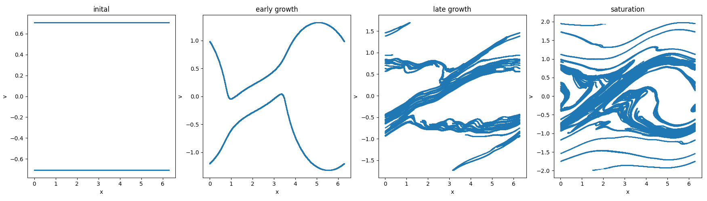

# Kinetic
Physics simulations written from scratch, each validated against an analytical solution (nerd math) instead of just looking about right.


I am doing a plasma physics simulation to pay homage to the Columbia SHP course on plasma physics that got me hooked on physics, which eventually led me towards engineering.
But i plan to fold multiple types of simulations here eventually and then fold as many as i can into a sandbox. But as of right now, it has two plasma physics simulations.



## What it does
This is a 1D electrostatic particle-in-cell plasma simulation (PIC). It runs in the browser and uses sliders for a user to adjust simulation parameters. There are two simulations currently active. Their descirptions are provided below.

**Plasma Oscillation** simulates a small nudge to a uniform plasma. The plasma particles are knocked past their equilibrium point and then tries to self correct, but then overshoots, so it ends up looking like a mass on a string, except the restoring force is the E field from the electrons. This causes the system to be periodic/sinusoidal in nature.  
**Two-Stream Instability** simulates two electron beams fired into each other. The system swings out of eqiulibrium, and this instability grows and grows, hence the name. This instability occurs because it takes the energy from the ordered motion and rolls the thing up into swirling voertces when seen in phase space.


## How to Run
Go to this link: [https://kinetic-physics-sim.streamlit.app/ ](https://sim.kinetic1.hackclub.app/)
If you want to run this locally, then here:
```bash
pip install -r requirements.txt
streamlit run kinetic_app.py
```
`python pic.py` runs a self-test on the growth rate formula.


## Files

| File | What's in it |
|---|---
| `pic.py` |grid setup, charge deposition, FFT field solve, interpolation, growth rate 
| `sims.py` | Simulation drivers that sets up initial conditions and runs the PIC loop 
| `kinetic_app.py` | Streamlit interface 
| `journal.md` | Build log, including the bugs 
| `notes.md` | Physics notes I took while working it out. Can be ignored imo

The practice folder is the iterations I made to figure out how to simulate each component, which was compressed into the files you see above.


## The result
The two-stream instability is described by a closed form growth rate, so I can check the simulation pretty easily against math.
| Measured from simulation | **γ = 0.342** |
| Theory | **γ = 0.344** |
| Error | **0.6%** |

The theory line is derived from the dispersion relation equation using the parameters the users select. 
Deriving that was pretty annoying. I originally hardcoded gamma = 0.354, which I believe is the most unstable numbers. Fixing it dropped the error a lot. 

## Method
    I used normalized units to make thigns easy. (omega_p = 1, epsilon = 1, q/m = 1) Pretty much everything I can set to 1 was set to 1.
There are four well documented steps for Plasma PIC. Whice are:
1. **Deposit**  spreads particle charge onto the grid with cloud-in-cell weighting
2. **Solve**  uses Poisson's equation via FFT, with a frozen uniform ion background
3. **Interpolate**  samples the field back at each particle, same weighting as step 1
4. **Push** leapfrogs integration

## Whats Next
I want to add Landau dampening, then rigid body dynamics as a second module along side the plasma physics one.

Sources: Francis Chen's Introduction of Plasma Physics and Controlled Fusion
