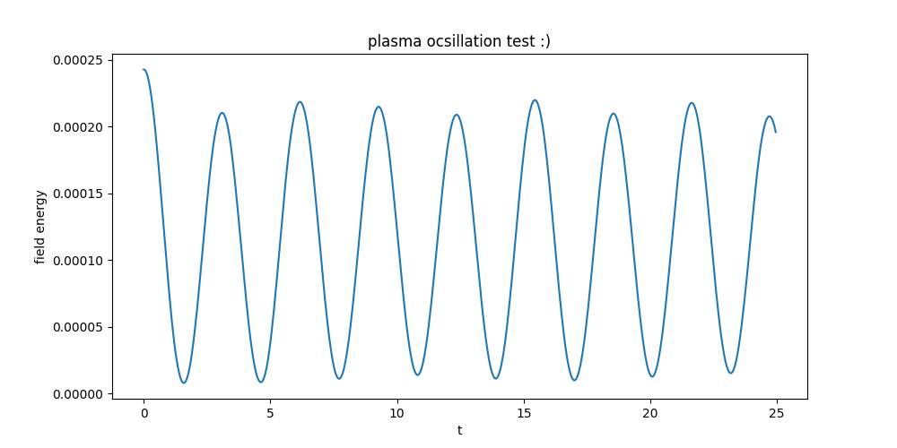
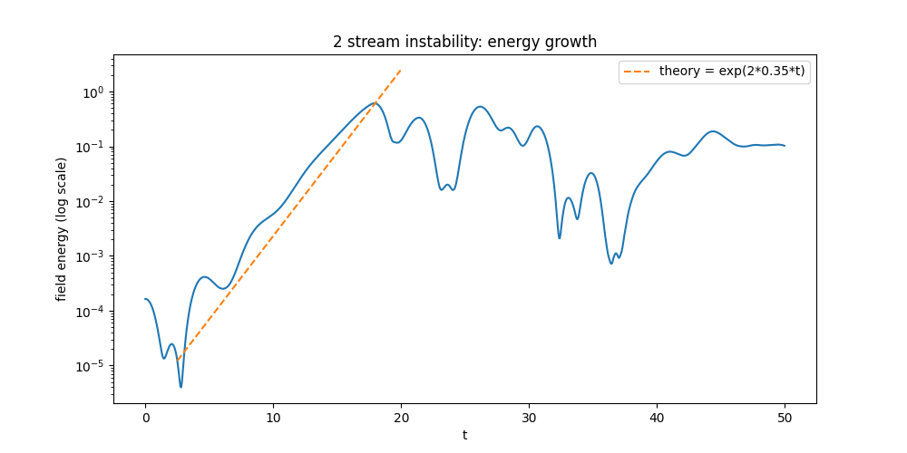
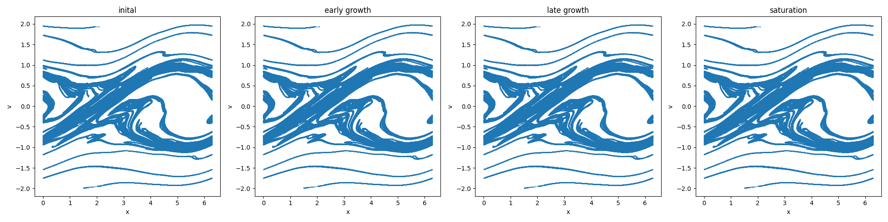
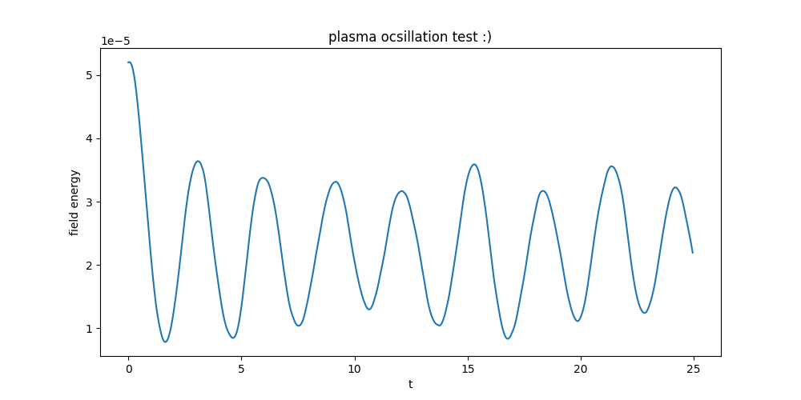

## 8/11/2026
    fixed a bug in my code where the perturbation I seeded wasn't even interacting with the loop. Simple fix. 
    This does mean that the graph I generated yesterday isn't as accurate as it can be. 
    
    Compare the two plots, the amplitudes of the new oscillation plot is larger. 
    8 peaks over 25 units of time, is about a period of about 3.
    Given that frequency is 6.14/ period, the frequency is about 2
    
    
**phase 3**

     planning to work on the 2 stream instability and attempt to get phase eye diagrams.

     The dispersion relation for two symmetric cold beams predicts a max growth rate of k * v0 ~~ w_p / sqrt2

     my paramets w_p = 1 and k = 1
     so therefore, V0 shoud roughly be 1/sqrt2 or 0.707
    
    i copied the functions and parameters from phase 2 into a new file so the two of them are not cluttered.
    phase 3 generates 2 plots: one discribes the field energy growth over time as a semilog plot
    simulated growth rate vs theory

    linear growth phase lasts from t~5 to t~19 where it kinda matches the theory line
    yay
    looks like saturation starts at around t = 20 where the energy kinda plateaus

    i believe the dip at t = 35 is likely the phase space vortices merging

    the other is 4 phase-space plots

    I don't believe this is right. They shoudn't all look the same. Probably a minor bug on my code where i capture the same snap shot 4 times
    will try again/

**the issue was that the if statement for the snapshots wasnt properly nested within the PIC loop, making the PIC loop finish first and then the snapshots capture the same thing 4 times** 

this is the corrected phase space one

## 8/10/2026

**Did**
- used fourier space to solve poissons equation
- generated a sinusoidal pertubation and plotted it
- varied the number of particles to see how smooth the sinusoidal looks after the noise evens outi

noticed that the charge density roughly looks like a sin function, but with much more noise
noticed that the electric field looks like a cos function (sin with a 90 deg transformation)/ this one evened out the noise much better
Test 2- apply a small cosine displacement to the particles, this should make the density plot look like a -sin plot
    Havent quite grasped the math yet, just know it should work. 

what was hard? walkm=ing myself through the math again. 

What did I learn? embarassingly, i took some time to experiment with how to have two plots on the same screen, i usually generate them separately. Did this because I saw a matlab script have like 8 plots placed together.

**stuff to think about**
    I should find a way to make this interactive, considering steamlit, which is a python framework that I came accross when I was scrolling instagram. 

**second session**
Extended kinetic2_2.py to a PIC simulation. Built the interpolation_field function. 
Field energy oscillates kinda nicely at -2 * omega_p (ang freq)

**sadly i forgot to save the graphs of the work before the oscillation test** 

I would have to note that the energy starts really high at t = 0

**next steps**
    phase 3: probably going to attempt a 2 stream instability 
        instead of just one electron population, we have two beams rushing against each other, then I seed a perturbation and see what happens
        what I should get is an instability so it isnt just a simple oscillation and should wobble out of control
        the two beams should bend into each other as these wobbles grow and turn into these eye shaped plots called phase space vortices

    phase 4: Landau damping (will need to learn what this is first)
## 8/9/2026
playing around in kinetic_2. In phase 1 i only practiced making a box with some particles in it to warm up my numpy skills. Phase 2 i was playing around with charge densities and distributions in 1d in a CIC.
**Did**
- built charge deposition using CIC weighing
- ran noise scaling experiments with varying N and Ng.

** Learned **
- Ion background (frozen Ion/jellium approximation using 'rho += 1)
- used +=1 to balanec the -1 charge of the electrons
- we do this because protons much heavier than electrons on the timescales (they move much more slowly compared to the electrons)

** Next: ** Poisson solve using fft

Uniform particle distribution should give near zero net charge/field (which was about right for my sim)
